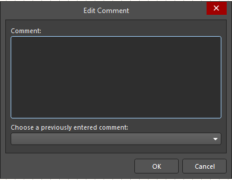
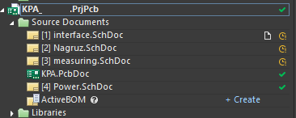

<!-- ---
puppeteer:
  landscape: false
  format: "A4"
  tagged: true
  timeout: 3000 # <= Special config, which means waitFor 3000 ms
--- -->

# Работа с локальными SVN-репозиториями в Altium Designer

## Содержание

- [Работа с локальными SVN-репозиториями в Altium Designer](#работа-с-локальными-svn-репозиториями-в-altium-designer)
  - [Содержание](#содержание)
  - [Создание SVN-репозитория](#создание-svn-репозитория)
  - [Подключение к существующему репозиторию](#подключение-к-существующему-репозиторию)
  - [Подключение проектов из SVN-репозитория](#подключение-проектов-из-svn-репозитория)
  - [Создание проекта с системой контроля версий](#создание-проекта-с-системой-контроля-версий)
  - [Загрузка проекта в SVN-репозиторий](#загрузка-проекта-в-svn-репозиторий)
  - [Добавление и обновление файлов](#добавление-и-обновление-файлов)
  - [Синхронизация версий проекта между несколькими пользователями](#синхронизация-версий-проекта-между-несколькими-пользователями)

## Создание SVN-репозитория

1. Заходим в настройки репозиториев: Preferences -> Data Management (`1`) -> Design Repositories (`2`):

(`3`) - Список подключенных репозиториев, их тип, путь к репозиторию и статус (зелёная галочка, если подключение успешно);

(`4`) - Создание нового репозитория;

(`5`) - Подключение к уже существующему репозиторию.

2. Нажимаем на кнопку `Create New` и выбираем тип `SVN`:

3. В открывшемся меню настраиваем параметры нового репозитория:

(`1`) - Название репозитория (на английском и без пробелов);

(`2`) - Путь на локальном компьютере, куда будут выгружены файлы проекта;

(`3`) - Метод подключения (выбираем `file`, если репозиторий лежит в общей папке);

(`4`) - Папка, в которой будет находиться сам репозиторий и к которой необходимо подключиться;

> Altium позволяет использовать пробелы и русские символы в пути к папкам, но некорректно их отображает

(`5`) - После заполнения все параметров нажимаем `OK` и репозиторий создан.

## Подключение к существующему репозиторию

1. Заходим в настройки репозиториев: Preferences -> Data Management (`1`) -> Design Repositories (`2`):

2. Нажимаем на кнопку `Connect To` и выбираем тип `SVN`:

3. В открывшемся меню настраиваем параметры подключения:

(`1`) - Название репозитория (то, как он будет называться в других меню Altium);

(`2`) - Путь на локальном компьютере, куда будут выгружены файлы проекта;

(`3`) - Метод подключения (выбираем `file`, если репозиторий лежит в общей папке);

(`4`) - Папка, в которой находится репозиторий;

(`5`) - Подпапка репозитория (если есть);

(`6`) - Проверка подключения к репозиторию;

Если подключение успешно:

Если подключение не было осуществлено (в данном случае намеренно был искажён путь до репозитория):

(`7`) - После заполнения все параметров нажимаем `OK` и репозиторий создан.

## Подключение проектов из SVN-репозитория 

1. Для выгрузки проектов из репозитория зайти в меню `File` и выбрать опцию `Check Out...`

2. В меню `Check Out...` необходимо установить следующие опции:

(`1`) - Выбрать нужный репозиторий (если их несколько);
(`2`) - Выбрать проект из репозитория;
(`3`) - Выбор пути, где будут лежать файлы проекта;
(`4`) - Подтверждение выбора;

3. Загруженный проект выглядит так:

> Отметки напротив файла соответствуют его статусу:
> - Зелёная галочка - файл на компьютере синхронизирован с репозиторием
> - Красный кружок - файл на компьютере содержит изменения, которых нет в репозитории
> - Жёлтый циферблат - файл на компьютере не синхронизирован, в репозитории лежит новая версия (при обновлении возможен конфликт слияния, осторожнее)
> - Восклицательные знаки - конфликт слияния
> - Синий крестик - файл будет добавлен в следующем коммите

## Создание проекта с системой контроля версий

Для создания проекта в созданном репозитории в меню `Create Project` в поле `Locations` выбрать опцию `Version control` (`1`). 

Далее установить следующие параметры:

(`2`) - Тип проекта;

(`3`) - Название проекта;

(`4`) - Название используемого репозитория;

(`5`) - Папка внутри репозитория, где будет находиться проект;

(`6`) - Папка на компьютере, где будут лежать файлы проекта.

Далее нажать `Create`. Проект создан.

## Загрузка проекта в SVN-репозиторий

1. Для загрузки локального проекта в SVN репозиторий необходимо в меню проекта выбрать вкладку `History & Version Control`, а в ней опцию `Add projects to Version Control...`.

2. В появившемся меню необходимо настроить опции добавления.

(`1`) - Выбор репозитория, в который добавится проект;

(`2`) - Выбор уже существющей папки в репозитории;

(`3`) - Создание новой (по умолчанию создаётся с названием проекта) - предпочтительный вариант;

(`4`) - Подтверждение выбора.

3. Далее необходимо выбрать файлы для добавления.
> Важно! В репозиторий не получится загрузить библиотеки, не лежащие в папке проекта (например, общие библиотеки на сетевом диске).

4. После выбора файлов нажать `OK`. Итоги добавления файлов:

## Добавление и обновление файлов

1. Для того, чтобы добавить новый файл в систему контроля версий в опциях файла
выбрать вкладку `History & Version Control`, а в ней опцию `Add to Version Control...`.

2. После этого напротив файла появится пиктограмма (синий крестик).

3. Для синхронизации версий проекта в репозитории и на компьютере необходимо сделать коммит. 

> При внесении изменений в файл, включенный в систему контроля версий, напротив его названия появится пиктограмма (красный кружок). Для внесения изменений в репозиторий тоже необходимо сделать коммит (файла или всего проекта). 

4. Возможен коммит одного конкретного файла: 

5. Либо коммит всего проекта (целесообразно, если изменено сразу несколько файлов):

6. Любой коммит содержит в себе комментарий. Рекомендуется, чтобы он был содержательным (для простоты поиска в будущем). По нажатию кнопки `OK` коммит будет влит в репозиторий.

## Синхронизация версий проекта между несколькими пользователями

> Важно! Перед тем, как начинать вносить новые изменения в проект необходимо добавить в локальную версию изменения, внесенные в репозиторий ранее, иначе может возникнуть конфликт слияния (merge conflict)

1. Пользователь, внёсший измения в свою локальную версию, должен внести их в репозиторий (см. [здесь](#добавление-и-обновление-файлов)).

2. Необходимо обновить информацию о репозитории. Для этого в меню проекта или файла выбрать вкладку `History & Version Control`, а в ней опцию `Refresh`.

3. При наличии новых версий напротив названия файла будет отображена пиктограмма (желтый циферблат).

4. Для синхронизации с репозиторием необходимо в меню проекта или файла выбрать вкладку `History & Version Control`, а в ней опцию `Update` (для файла) или `Update Project From Server`.

5. Далее при обновлении проекта будет открыто окно, в котором необходимо отметить файлы, которые должны быть обновлены, и нажать `Update`.

6. Вид обновленного проекта представлен ниже:

